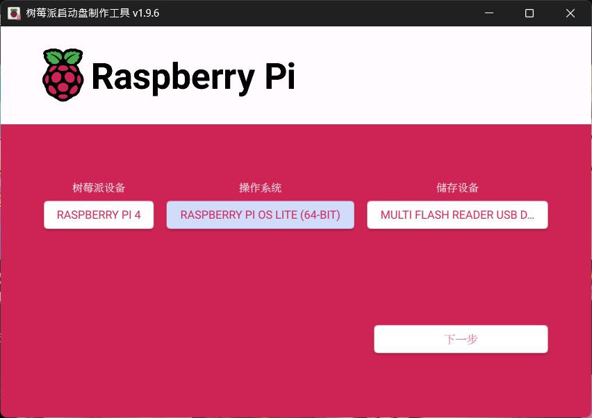
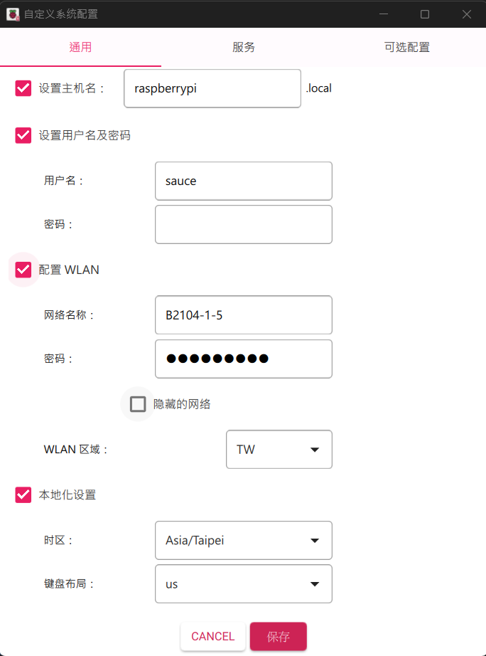
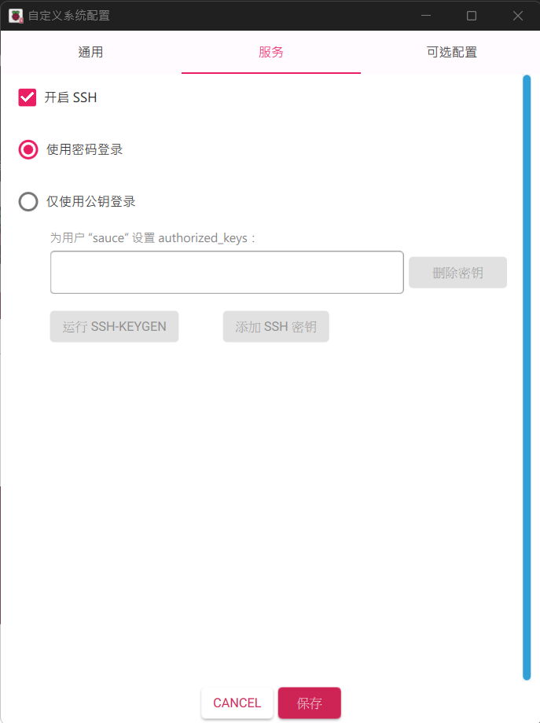

# 樹莓派安裝說明

## 目錄

- [本文使用軟體](#本文使用軟體)
- [樹莓派作業系統下載/安裝](#樹莓派作業系統下載安裝)

## 本文使用軟體

### Linux 系統安裝程式

- [Raspberry Pi Imager](https://www.raspberrypi.com/software/)

### 遠端 SSH 連線軟體

- [Tabby teiminal](https://tabby.sh/)
- [Tera Term](https://teratermproject.github.io/index-en.html/)

### 遠端檔案傳輸軟體

- [FileZilla](https://filezilla-project.org/)

## 樹莓派作業系統下載/安裝

1. 首先至 Raspberry Pi 官網安裝 [Raspberry Pi Imager](https://www.raspberrypi.com/software/)  
      
依據對應的作業系統下載後安裝

1. 插入SD卡至讀卡機，打開後選擇對應的樹莓派設備、操作系統、SD卡位置  
    

1. 選擇編輯設置  
    

1. 設定樹莓派如圖所示  

    
    

> [!NOTE]  
> 建議每次燒錄系統都重新確認 使用者與 WiFi 帳號密碼是否正確  
> 同時確保 SSH 為開啟狀態

1. 點擊確認  
    
    

1. 等待燒錄完成  
    
