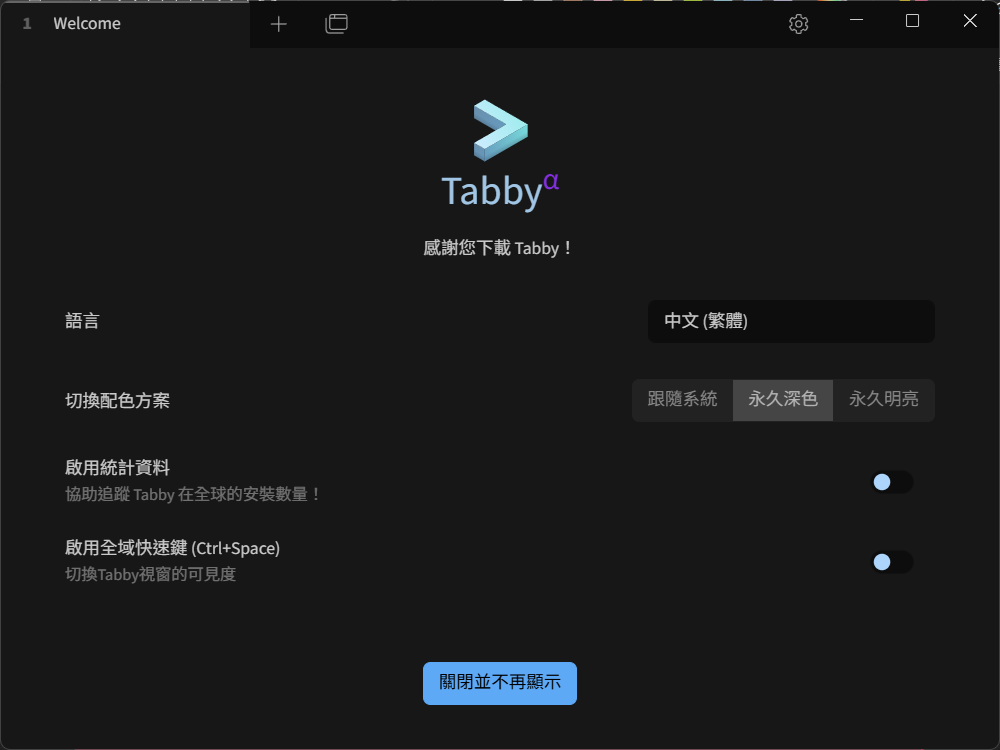
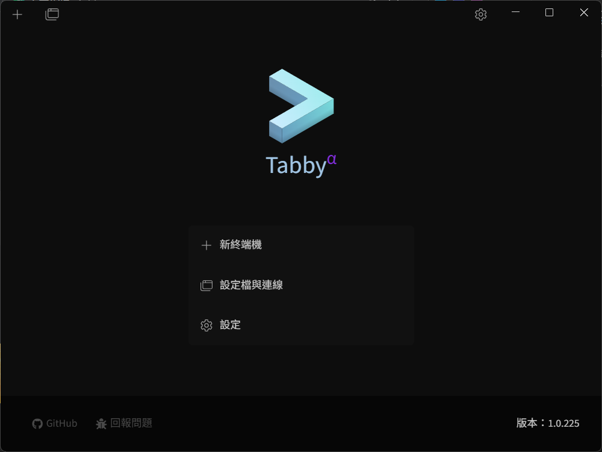
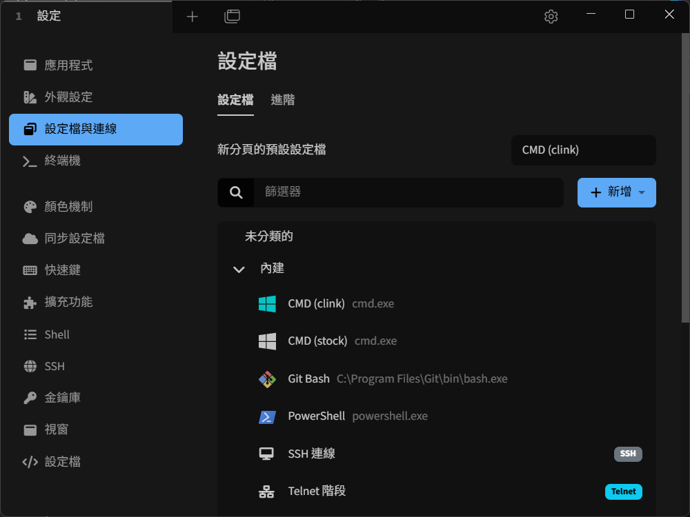
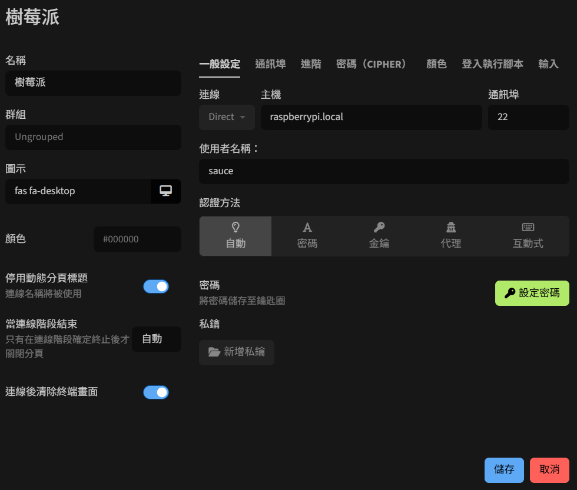
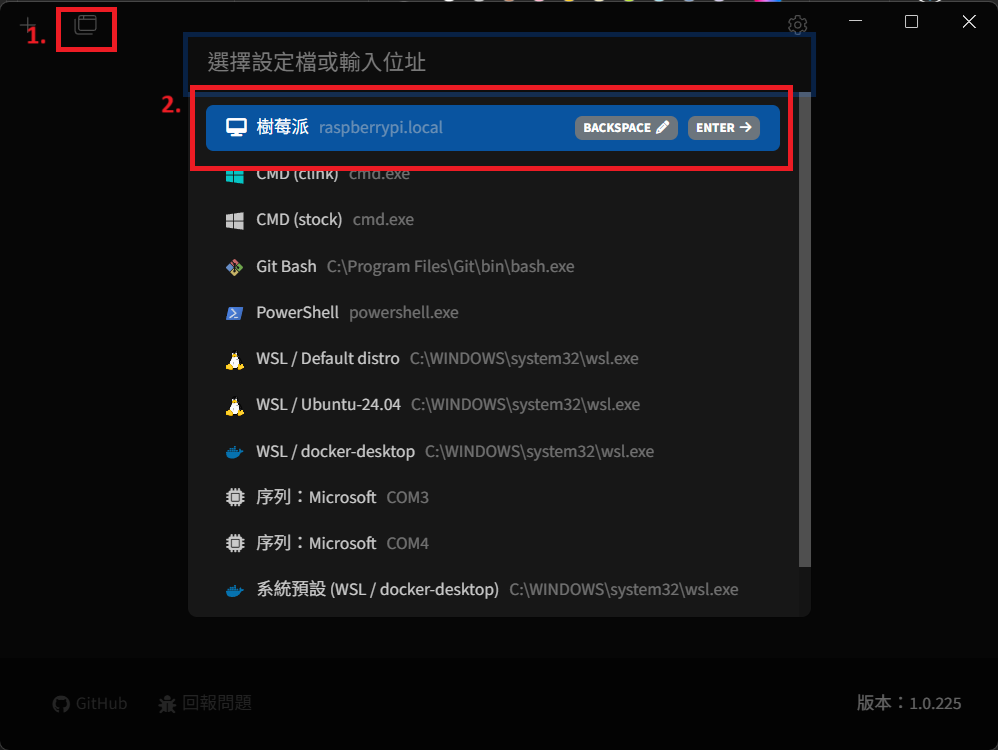
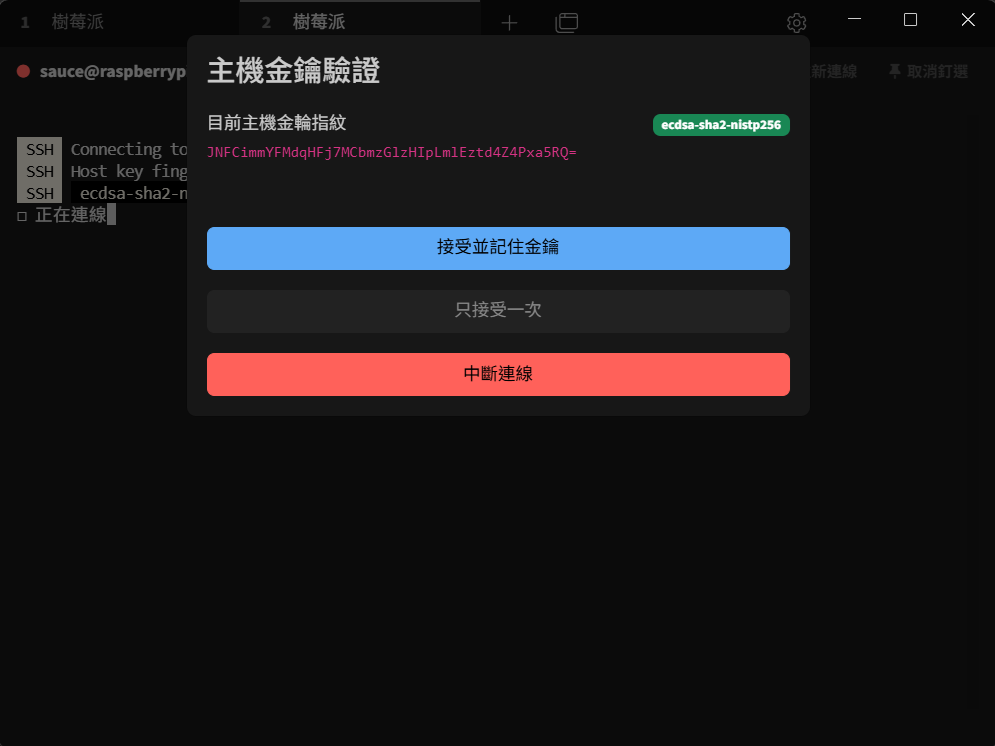
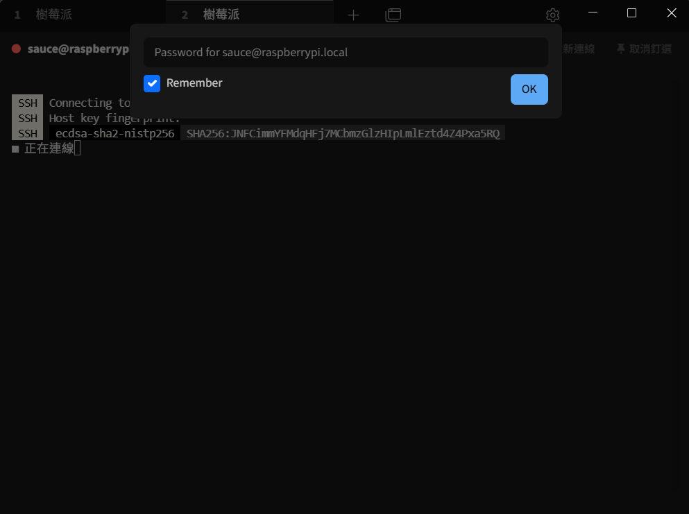
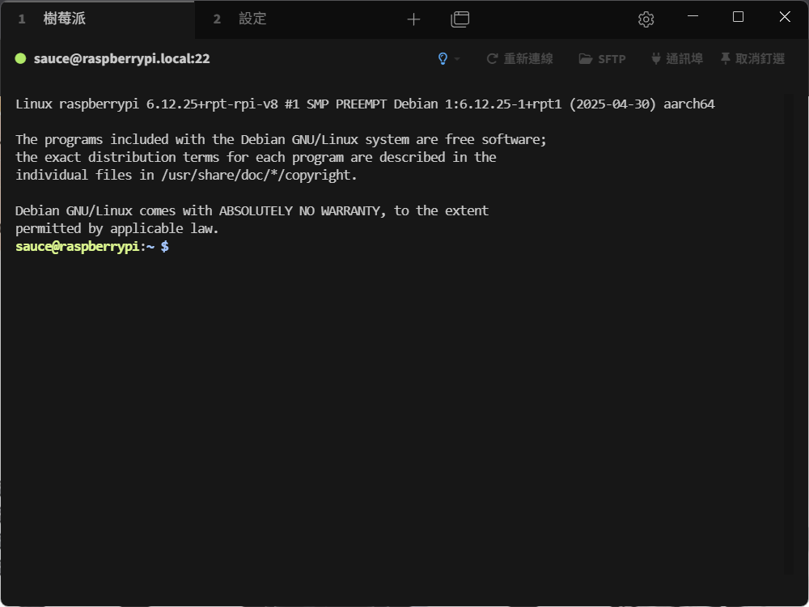

# 初始化設定說明

本章將介紹樹莓派初始化設定  
使用軟體(組合)選擇：  

- [Tabby teriminal](https://tabby.sh/)
- [Tera Term](https://teratermproject.github.io/index-en.html/) + [FileZilla](https://filezilla-project.org/)

> 或其他 SSH 軟體和 SFTP 軟體  
>
> 本章將使用 Tabby Terminal 進行操作

## Tabby Terminal 下載安裝與設定

1. 在 [Tabby GitHub release](https://github.com/Eugeny/tabby/releases) 頁面選擇對應系統下載

1. (安裝過程略過)

1. 開啟 Tabby 後可以選擇語言與配色
    
1. 於主頁面點選設定 → 設定擋與連線 → 新增 → 新設定檔，添加 SSH 連線  
    
    

1. 填入於 [作業系統安裝](./作業系統安裝) 設定對應的內容與使用者名稱、密碼  
    

1. 將燒錄完成的 SD 卡插入樹莓派並通電開機，確認電腦在相同的 WiFi 網路環境下

1. 根據圖片步驟連線至樹莓派  
    

1. 點選接受並記住金鑰 && 輸入密碼  
    
    

1. 顯示此畫面代表建立與連線成功  
    

> [!NOTE]
> 若顯示失敗或錯誤，檢查帳號/密碼/.local域名是否設定正確  
> 或者確認樹莓派已完全開機  
> 如果依舊無法正常連線，可嘗試重新安裝系統並檢查設定
